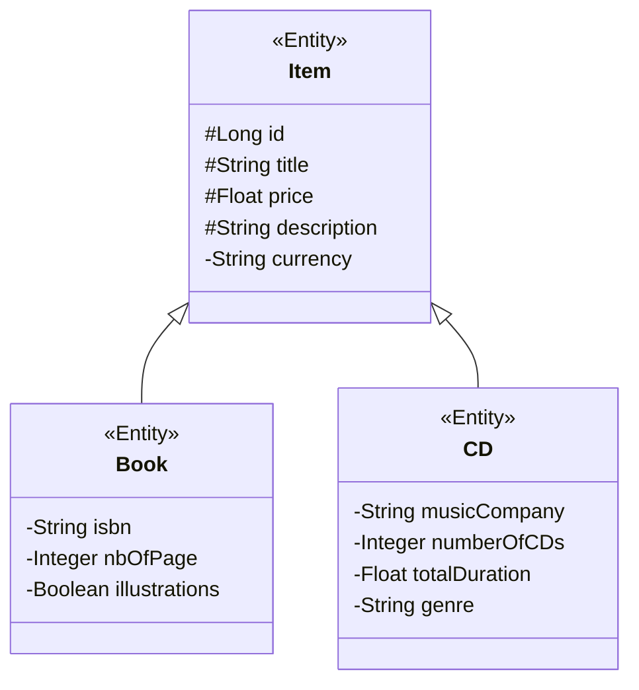

# Architectural Audit & Java EE Specification Mapping

This document provides a comprehensive audit of the **book-application** codebase. It maps the project components to the Java EE specification standards, explains their container-managed runtime execution workflows, and details the infrastructure configuration.

---

## 1. Textbook Concept Mapping Matrix

| Project Component / Class | Java EE Spec / Technology | Textbook Chapter / Concept | Implementation Status |
| :--- | :--- | :--- | :--- |
| [`Item`](file:///c:/Users/jcando/anti-projects/JAVAEE/book-application/src/main/java/com/enterprise/domain/Item.java) | JPA (Java Persistence API 2.2) | Chapter 5: Object-Relational Mapping (ORM) & Inheritance | Fully Covered |
| [`Book`](file:///c:/Users/jcando/anti-projects/JAVAEE/book-application/src/main/java/com/enterprise/domain/Book.java) | JPA (Java Persistence API 2.2) | Chapter 5: Inheritance Mapping (Joined Strategy) | Fully Covered |
| [`CD`](file:///c:/Users/jcando/anti-projects/JAVAEE/book-application/src/main/java/com/enterprise/domain/CD.java) | JPA (Java Persistence API 2.2) | Chapter 5: Entity Polymorphism & Named Queries | Fully Covered |
| [`BookEJB`](file:///c:/Users/jcando/anti-projects/JAVAEE/book-application/src/main/java/com/enterprise/business/BookEJB.java) | EJB (Enterprise JavaBeans 3.2) | Chapter 7: Stateless Session Beans & Remote Views | Fully Covered |
| [`ItemEJB`](file:///c:/Users/jcando/anti-projects/JAVAEE/book-application/src/main/java/com/enterprise/business/ItemEJB.java) | EJB (Enterprise JavaBeans 3.2) | Chapter 7: Business Logic Processing & JPA Integration | Fully Covered |
| [`CacheEJB`](file:///c:/Users/jcando/anti-projects/JAVAEE/book-application/src/main/java/com/enterprise/business/CacheEJB.java) | EJB (Enterprise JavaBeans 3.2) | Chapter 7: Singleton Session Beans & Concurrency Control | Fully Covered |
| [`StatisticsEJB`](file:///c:/Users/jcando/anti-projects/JAVAEE/book-application/src/main/java/com/enterprise/business/StatisticsEJB.java) | EJB (Enterprise JavaBeans 3.2) | Chapter 7: Declarative Enterprise Scheduling | Fully Covered |
| [`ShoppingCartEJB`](file:///c:/Users/jcando/anti-projects/JAVAEE/book-application/src/main/java/com/enterprise/business/ShoppingCartEJB.java) | EJB (Enterprise JavaBeans 3.2) | Chapter 7: Stateful Session Beans & Session Lifecycle | Fully Covered |
| [`CustomerEJB`](file:///c:/Users/jcando/anti-projects/JAVAEE/book-application/src/main/java/com/enterprise/business/CustomerEJB.java) | EJB (Enterprise JavaBeans 3.2) | Chapter 7: Programmatic Timer Service & Serialized Info | Fully Covered |
| [`persistence.xml`](file:///c:/Users/jcando/anti-projects/JAVAEE/book-application/src/main/resources/META-INF/persistence.xml) | JPA Configuration | Chapter 5: Persistence Units & JTA DataSources | Fully Covered |
| [`glassfish-resources.xml`](file:///c:/Users/jcando/anti-projects/JAVAEE/book-application/src/main/resources/META-INF/glassfish-resources.xml) | Java EE Resource Definition | Chapter 5: Connection Pooling & JNDI Registration | Fully Covered |

---

## 2. Component Deep Dive & Architectural Workflow

### A. Java Persistence API (JPA) Domain Model
The persistent domain model comprises an inheritance hierarchy rooted at `Item`, with concrete subclasses `Book` and `CD`.



#### Container Mechanics
- **Inheritance Mapping**: The project utilizes the `InheritanceType.JOINED` strategy. The container and JPA provider (EclipseLink) generate a base table `ITEM` containing shared columns, and distinct sub-tables `BOOK` and `CD` containing specific columns mapped via a foreign key reference pointing to the primary key of `ITEM`.
- **Entity Lifecycle**: Entities transition through the four lifecycle states (New, Managed, Removed, Detached) controlled by the `EntityManager`.
- **Identity Generation**: Identifiers are managed using database identity columns (`GenerationType.IDENTITY`), ensuring database-driven primary key generation during insert.

#### Code Traceability
- **`@Entity`**: Used on `Item`, `Book`, and `CD` to mark them as persistent JPA-managed entities.
- **`@Inheritance(strategy = InheritanceType.JOINED)`**: Declared on `Item` to configure the relational layout for subclasses.
- **`@NamedQuery`**: Used on `Book` (`findAllBooks`) and `CD` (`findAllCDs`) to pre-compile and optimize JPQL queries.
- **`@Id` & `@GeneratedValue(strategy = GenerationType.IDENTITY)`**: Specified on `Item.id` to configure identity-based primary key sequencing.

---

### B. Stateless Session Beans (SLSB)
`BookEJB` and `ItemEJB` implement remote and local views to manage transactional enterprise operations.

#### Container Mechanics
- **Stateless Lifecycle**: The EJB container manages a pool of stateless bean instances. When a client invokes a business method (either remotely or locally), the container assigns a temporary instance from the pool.
- **Dependency Injection**: The container injects the target database `EntityManager` context automatically using the `@PersistenceContext` annotation.
- **Transactional Boundaries**: By default, SLSB methods use Container-Managed Transactions (CMT) with the `REQUIRED` attribute. The container intercepts invocations to start a JTA transaction if none exists, and commits or rolls it back automatically when the method exits.

```
Client Invocation
      |
      v
[Container Transaction Interceptor]  --> Starts JTA Transaction
      |
      v
[EJB Pool Instance]                 --> Executes Business Logic
      |
      v
[Persistence Context / DB]          --> Flushes SQL (em.persist, em.merge)
      |
      v
[Container Transaction Interceptor]  --> Commits JTA Transaction
      |
      v
Client Returns
```

#### Code Traceability
- **`@Stateless`**: Declared on `BookEJB` and `ItemEJB` to define them as pooled stateless session components.
- **`@Remote`**: Specified in `BookEJBRemote` and `ItemRemote` to support remote method calls across JVM boundaries.
- **`@Local`**: Specified in `ItemLocal` to allow optimized local invocations within the same JVM context.
- **`@PersistenceContext(unitName = "bookApplicationPU")`**: Used to inject the JTA-bound `EntityManager` associated with the configured persistence unit.

---

### C. Singleton Session Beans & Concurrency Management
`CacheEJB` operates as a single shared cache component across the entire application lifespan.

#### Container Mechanics
- **Singleton Lifecycle**: The container creates exactly one instance of the bean upon application initialization.
- **Container-Managed Concurrency (CMC)**: Concurrency is managed declaratively by the container. By default, `@Lock(LockType.READ)` allows multiple threads to access data concurrently.
- **Write Lock & Serialization**: When a method annotated with `@Lock(LockType.WRITE)` is invoked, the container blocks concurrent readers/writers, serializing access to safeguard shared memory structures.
- **Access Timeout**: Prevents thread starvation or deadlocks by rejecting execution requests that fail to acquire the write lock within a designated time window.

#### Code Traceability
- **`@Singleton`**: Defines `CacheEJB` as a unique instance shared across all application threads.
- **`@Lock(LockType.READ)`**: Configured at the class level to make reading cached items non-blocking.
- **`@Lock(LockType.WRITE)`**: Explicitly declared on `addToCache` and `removeFromCache` to guarantee thread-safe modifications to the underlying map.
- **`@AccessTimeout(2000)`**: Configured to raise a `ConcurrentAccessTimeoutException` if threads wait longer than 2 seconds for write access.

---

### D. Stateful Session Beans (SFSB)
`ShoppingCartEJB` acts as a stateful component associated with one and only one client conversation.

#### Container Mechanics
- **Conversational State**: Unlike stateless beans, the stateful session bean instance keeps private state (`cartItems`) between method calls from the same client.
- **Passivation and Activation**: When memory runs low or when configured thresholds are crossed, the container can *passivate* idle beans by serializing their state to secondary storage. Upon the next client request, the container *activates* the bean back into memory.
- **Idle Timeout**: If a client remains inactive for longer than specified, the container automatically destroys the bean instance to reclaim memory resources.
- **Lifecycle Destruction**: Clients can explicitly terminate a stateful conversation by invoking a method marked with `@Remove`. The container will execute the method and then destroy the bean.

```
Client Invoking
      |
      +-----> cartEJB.addItem(item)   --> [Stateful Session EJB] (Keeps cart state)
      |
      +-----> cartEJB.getTotal()      --> [Stateful Session EJB] (Computes on current state)
      |
      +-----> cartEJB.checkout()      --> [Stateful Session EJB] (Processes & triggers @Remove)
                                                     |
                                                     v
                                      [Container destroys EJB instance]
```

#### Code Traceability
- **`@Stateful`**: Declares `ShoppingCartEJB` as a stateful component dedicated to a single conversation session.
- **`@StatefulTimeout(20000)`**: Configures the passive state threshold. If the client is idle for over 20 seconds, the bean is removed from memory by the container.
- **`@Remove`**: Annotated on `checkout()` and `empty()`. Tells the container to release this bean instance from memory immediately after completing the method execution.

---

### E. Enterprise Scheduling & Timer Services
The system implements both **Declarative** (`StatisticsEJB`) and **Programmatic** (`CustomerEJB`) timers.

#### Container Mechanics
- **Declarative Scheduling**: The EJB container registers jobs defined by the metadata annotations on bean startup.
- **Programmatic Scheduling**: The bean calls the container-provided `TimerService` programmatically. Developers can dynamically configure `ScheduleExpression` (for calendars, hours, days) and pass a serializable payload inside a `TimerConfig` object.
- **Persistent Programmatic Timers**: By setting `TimerConfig(item, true)`, the container persists the timer definition and payload metadata to disk. If the application server crashes or restarts, the container restores the scheduled triggers and associated payload.
- **Timer Execution Callback**: For declarative timers, the annotated method is called directly. For programmatic timers, the container searches for a method marked with `@Timeout` to handle the event.

```
Client Request
      |
      v
[CustomerEJB.scheduleDynamicPriceAudit]
      |
      +---> em.persist(item)             --> Persists target entity
      +---> new ScheduleExpression()     --> Defines dynamic timer cron parameters
      +---> new TimerConfig(item, true)  --> Wraps entity payload and marks it persistent
      +---> timerService.createCalendarTimer()
                                         |
                                         v
                         [Registered in Container EJB Timer Pool]
                                         |
                                (Scheduled time arrives)
                                         |
                                         v
                              [Container Thread Pool]
                                         |
                                         v
                         [CustomerEJB.executePriceAudit (@Timeout)]
```

#### Code Traceability
- **`@Schedule` / `@Schedules`**: Configured in `StatisticsEJB` for static, declarative cron tasks.
- **`@Resource TimerService`**: Injected in `CustomerEJB` to gain programmatic access to the container's scheduler pool.
- **`ScheduleExpression`**: Used to dynamically assign parameters like `hour` and `minute`.
- **`TimerConfig`**: Instantiated with `new TimerConfig(item, true)` to pass the persistent target entity payload to the timer registry.
- **`@Timeout`**: Declared on `executePriceAudit` in `CustomerEJB` to register it as the EJB container's target callback handler for programmatic timer events.

---

## 3. Dependency & Infrastructure Mapping

### Connection Pooling & Data Source Configuration
The application leverages container-managed resources to coordinate transaction-safe database connections.

```
[persistence.xml]  --> References JNDI Resource (java:app/jdbc/bookApplicationDS)
      |
      v
[glassfish-resources.xml] --> Maps JNDI resource to Connection Pool (bookApplicationPool)
      |
      v
[PostgreSQL DB]     --> Establishes connections on localhost:5432
```

- **JNDI DataSource Registration**: `glassfish-resources.xml` defines the JNDI resource `java:app/jdbc/bookApplicationDS`, binding it to the connection pool `bookApplicationPool`.
- **Database Connection Pool**: The pool is configured to use the `org.postgresql.ds.PGSimpleDataSource` class to coordinate physical connections to the target PostgreSQL database `chapter05db` on port `5432`.
- **JTA Transaction Management**: `persistence.xml` configures the persistence unit with `transaction-type="JTA"`, delegating transaction commit/rollback coordination to the EJB container's Java Transaction API manager.
- **Payload Serialization Infrastructure**: Programmatic timer configurations carry entity payloads (`Item`). Because programmatic timers can be persistent (`true`), the payload class must implement the `java.io.Serializable` interface to allow the container to serialize the payload to storage.
